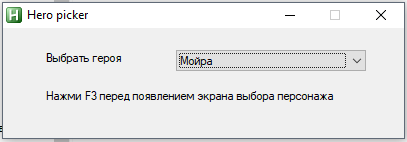

# HeroPicker Overwatch
Скрипт автоматического пика персонажей

Видео: https://www.youtube.com/watch?v=j3jgdCkroEQ

UPD: Добавлена Бригатта!
UPD 11.11.2018: Добавлена Эш и возможность выбора Разрешения экрана!

## Как работает? 

Программа написана на скрипте AutoHotKey. Она симулирует нажатие мыши и работает за счет поиска на экране ориентинрых пикселей.
Скрипт стабильно работает на протяжении 14 месяцев. 

## Как использовать? 

- Загрузи exe файл [от сюда.](https://github.com/idaspin/heropicker/releases)
- Запусти `heropicker.exe` и выбери персонажа, которого эта программа будет пикать в игре.
- Выбери разрешение экрана.
- Запусти Овервотч, установи режим отображения игры как "Полноэкранный в окне" (без границ).
- Запусти поиск матча.
- Нажми <kbd>F3</kbd>.
- Когда игра начнется, программа автоматически пикнет героя.
- Скрипт остановится как только, герой будет выбран. Также вы можете самостоятельно остановить скрипт нажав <kbd>F3</kbd>.

## Другое разрешение?

Напиши в Issues либо отпишись на нашем Дискорд сервере: 
https://discord.gg/QYshJff
