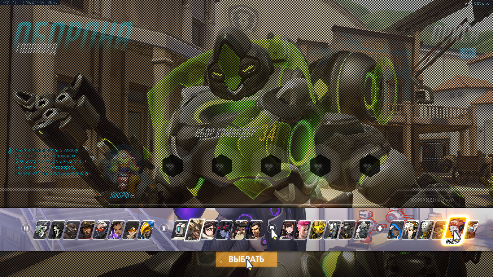
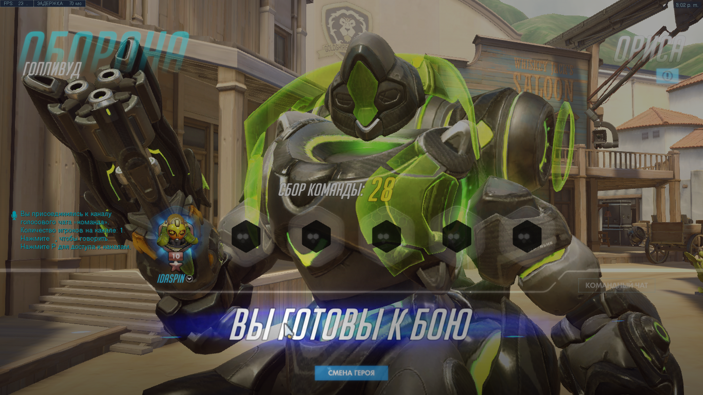

# HeroPicker Owerwatch
Скрипт автоматического пика персонажей

UPD: Добавлена Бригатта!

## Как работает? 

Программа написана на скрипте AutoHotKey. Она симулирует нажатие мыши и работает за счет поиска на экране ориентинрых пикселей.
Скрипт стабильно работает на протяжении 7 месяцев. (От марта 18года.) 

## Как использовать? 

- Загрузи exe файл [от сюда.](https://github.com/idaspin/heropicker/releases)
- Запусти `heropicker.exe` и выбери персонажа, которого эта программа будет пикать в игре.
- Запусти Овервотч, установи режим отображения игры как "Полноэкранный в окне" (без границ).
- Запусти поиск матча.
- Нажми <kbd>F3</kbd>.
- Когда игра начнется, программа автоматически пикнет героя.
- Скрипт остановится как только, герой будет выбран. Также вы можете самостоятельно остановить скрипт нажав <kbd>F3</kbd>.

## Другое разрешение?

Для компиляции и запуска вам потребуется программа AutoHotkey. Весит она не много и не требует дополнительных установок. Зайдите в игру, в быстрый матч или создайте собственное лобби и запустите матча, после чего сохраните на компьютер 2 скриншота: до выбора персонажа, и после нажатия кнопки "выбрать", пока ещё вы не респавнулись в игре. Теперь откройте блокнотом файл heropicker.ahk. Вам потребуется внести несколько правок.

- На десятой строке приведен список всех героев игры Overwatch, разделенные на пары: имя, координаты. Вам не обязательно заменять все координаты, понадобятся только те, на героях которых вы играете. Откройте оба скриншота при помощи графического редактора (у меня это Paint.Net). В строке "состояния/статуса" показываются координаты положения мыши на картинке. Ориентируясь по скриншотам задайте нужным героям их координаты.
- Теперь откройте скриншот, на котором вы уже выбрали персонажа и ожидаете спавна. Наведите мышь на надпись "вы готовы к бою" так, чтобы курсор находился прямо внутри буквы "Г". Запишите эту координату на 73ой строке файла heropicker.ahk.
- Откройте второй скриншот, и найдите иконку щита над головой D.Va'й. Наведите курсор на белый фон иконки и запомните координаты. Их следует вставить на 72 строку в файле heropicker.ahk.
- Вернитесь к последнему скриншоту и поместите курсор в центр кнопки "Выбрать". Эту координату следует вставить на строку 86 файла heropicker.ahk.
- Теперь сохраните изменения в файле heropicker.ahk и закройте его. Кликните правой кнопкой мыши по нему и выберите в выпадающем меню "Compile Script".

Готово! "heropicker.exe" теперь настроен под ваше разрешение экрана!
